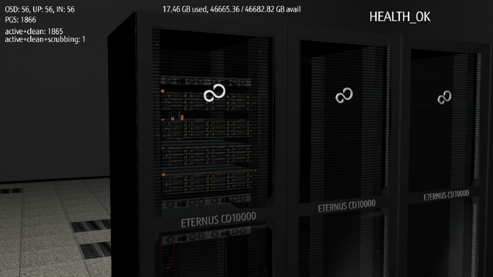
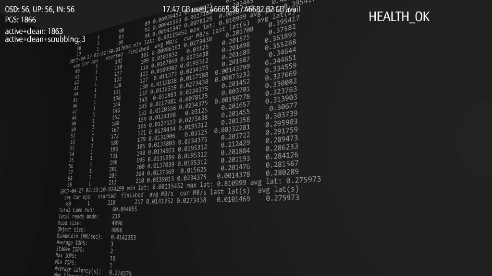

Hello Cephers!

Information about Ceph Days coming to Poland created quite a movement in our development team. We have been working with Ceph from the inside out for few years now and the opportunity to share our view and approach to this innovative SDS was quite exciting! We were also simply curious as to who is using Ceph in our country and in what scenarios.

There were many ideas what to present. We’ve built quite an impressive testing ecosystem around Ceph and basically we wanted to share every single line of code, yep that’s the typical R&D engineers approach ;) After hours of debate, finally we decided for “FakeMon” and “CPM”, two of our latest developed tools that (modestly speaking) we are proud of.

## **Ghost Cluster**

FakeMon is our internal tool that can simulate a cluster of any size in any state. When you’re writing sophisticated monitoring software, you need to be sure it could handle any possible situation that could happen. During some hard code (hardcore) refactoring and rewriting, we hit a wall that we couldn’t break or bypass – this wall was made of time. Literally we needed to wait for hours or even days to create specific conditions that should be noticed and handled properly by our new monitoring software.

So we took a shortcut.

Our new and shiny monitoring system is using RADOS protocol to fetch the state of a Ceph cluster, but it really does not need an actual cluster on the other side of the wire. It needs an entity that would act and react like a ceph monitor - respond to health status queries, return the number of OSDs, MONs etc. This is perfect job for FakeMon – a tool that was created to save tons of time that could instead be spent on more important stuff, like contemplating which op amp has the biggest amplification in negative feedback loop and enjoying a cup of coffee. Yes we are R&D engineers, we are “weird” OK?

The core of FakeMon is a Simple Messenger code example that is fed with health calculating code snippets borrowed from ceph-mon. Of course, to introduce the desired conditions, we added additional commands as well. With a short setup, we were able to simulate massive “ghost” cluster degradation, like creating a hard split-brain conditions or massive power loss that would flip out 90% of OSDs.

For more details and examples, I encourage you, our dear reader, to get familiar with our [presentation](attachments/Ghost_Cluster_and_Throwing_Fireballs.pdf).

## **Throwing Fireballs**

FakeMon is quite a clever way of testing monitoring software that is fed by the cluster status, but still it’s more synthetic approach and real life conditions are not always as we imagined them to be. When you add hardware to this equation, you’re actually adding a specified behavior. Behavior that it’s driven by physical conditions e.g. HDD spinning plate’s head going back and forth in amount of time that without bending basics laws can’t be shortened. Add to this HDD firmware that was written by some talented embedded programmer, on top of this there usually is a RAID firmware, one step further and we’re in kernel file-system driver and finally Ceph’s filestore implementation. It’s quite a long path when you add all the unattended bugs, workarounds, limitations or algorithms that were chosen by programmers during software/firmware development. Still I’m not counting actual user-space workload that could trigger Linux kernel interrupts in a unique way on different clusters.

So the question is: how can this sophisticated chain of behavior be tested?

The answer could be a paraphrased dialog from “Takedown” the movie form the year 2000.

“We need to create the ultimate cure for the ultimate disease, but first step is to create that disease.”

Throwing fireballs is a technique that we call for when we introduce a very hard condition into our test ecosystem: various network bottlenecks, computing power limitations, hardware failures or different user workloads combined with different setups. Basically, we “throw” a fireball (Hado-ken) in e.g. network stack and watch how it burns, observe Ceph behavior, write down conclusions, adjust configurations and … throw it again and again. One of the tools that was developed for this purpose is Ceph Process Manager, please don’t get confused with ceph-mgr, that is something completely different. Originally this was a tool for tracking ceph-osd and ceph-mon activity and determining if small changes in the Ceph source code that we‘ve introduced was significant enough to create performance related pull request to Ceph’s GitHub repository. Then we slightly rewrote it and used it to the opposite – to degrade performance.

## **Throwing Fireballs – the presentation**

Our presentation at Ceph Days was like a jumping into deep water, we didn’t know what audience expected: Ceph developers, administrators, system administrators, managers, Ceph consultants, or maybe people not so firmly bounded with IT, but just curious what is this whole SDS all about.

Our first idea was the typical developer approach – let’s show Linux terminal and bunch of commands that we execute, for sure everyone will understand. After our second cup of coffee we realized that we had already followed this approach with our FakeMon presentation, so what’s next, Power Point? Nah, “we need to go deeper”, Power Point presentation with some gifs and animations and maybe short movie? Three cups coffee later, neurons started to glow like a Christmas tree and the ultimate idea was born – let’s add one more dimension to this Ceph Day equation and create 3D game interface to Ceph and Throwing Fireballs technique with Ceph health status as HUD display!

And we actually did it!

Using Blender and some Python with (almost) hand-made graphics, we connected 3D objects, their behavior and properties to the actual physical server room in a different country. Each action in our 3D interface generated real reaction that was placed on real hardware with real Ceph cluster and we could observe everything on a HUD display.

We also spawned various actions, from running rados benchmarks through dropping desired percent of public/cluster network traffic to moving all ceph-osd processes to one logical CPU core.

Current cluster Monitor Log could be seen on one of the walls of our 3D server room. This data was directly fed from Ceph.

Another wall was presenting rados benchmark output which was refreshed once per second.

More detailed description you can find in our [presentation](attachments/Ghost_Cluster_and_Throwing_Fireballs.pdf).

## **Final thoughts and thanks**

In this very short time (under two weeks) we manage to add one more dimension to our testing tools and move them into 3D. None of this could happen without an idea that triggered this chain reaction and wonderful team of people working together and supporting each other.

I would like to especially thank to our whole R&D GDC Lodz team:

Klaudia Goczal, Zofia Domaradzka (FakeMon co-dev&presenter), Katarzyna Horodnicza, Maciej Pijanka (FakeMon idea, 3D co-dev), Adam Klimaszewski, Martin David Chacon Piza, Kacper Kolodziej (CPM co-dev), Zmitrovich Ihar, Dawid Gnilka, Mateusz Kolanski and Dan Garcia.

Also many thanks to everyone involved with bringing Ceph to Poland, as well as all the presenters and participants of Ceph Day Warsaw.

It was a real pleasure. I hope we meet again someday!

**This article was contributed by: Igor Podoski (FakeMon design&dev, 3D idea, design&dev, presenter).**

**Irc: aiicore at #ceph-devel, #ceph.**
