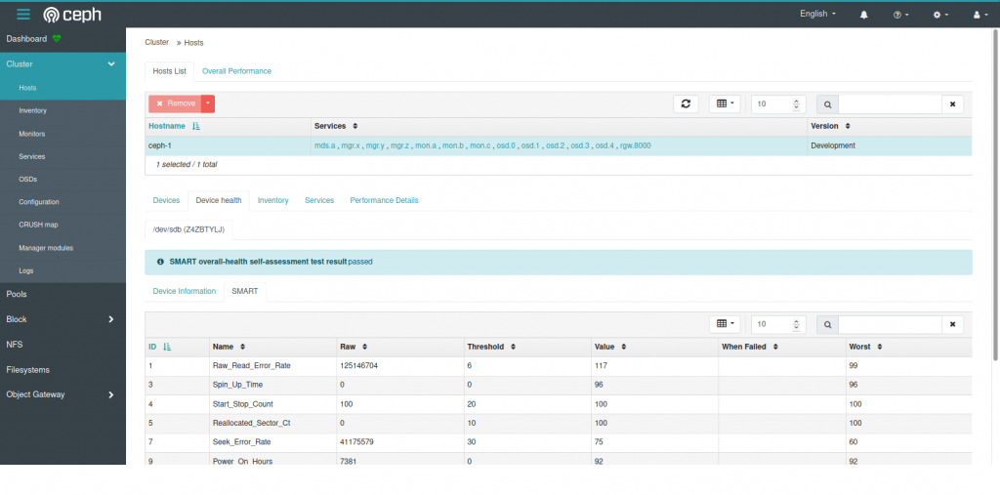
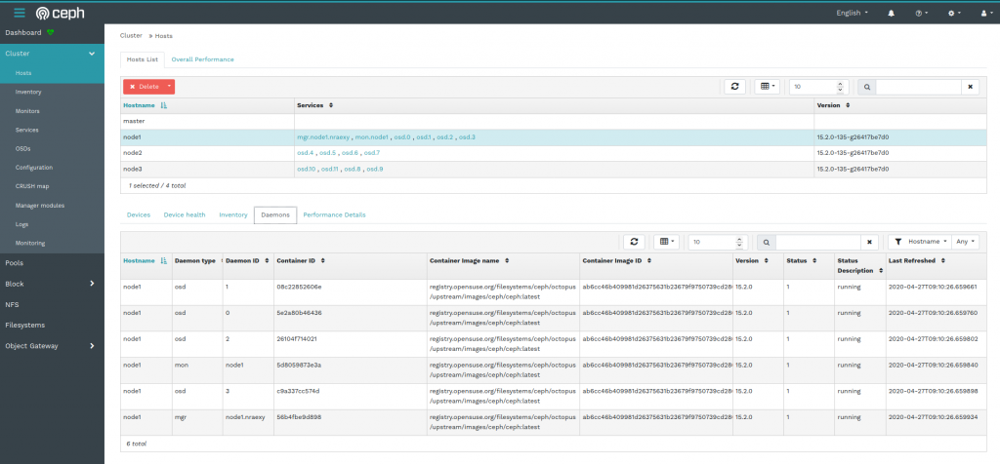
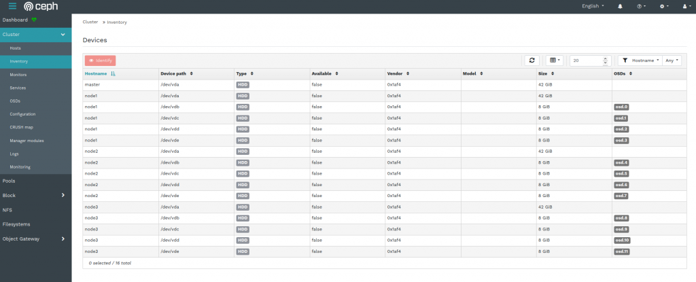
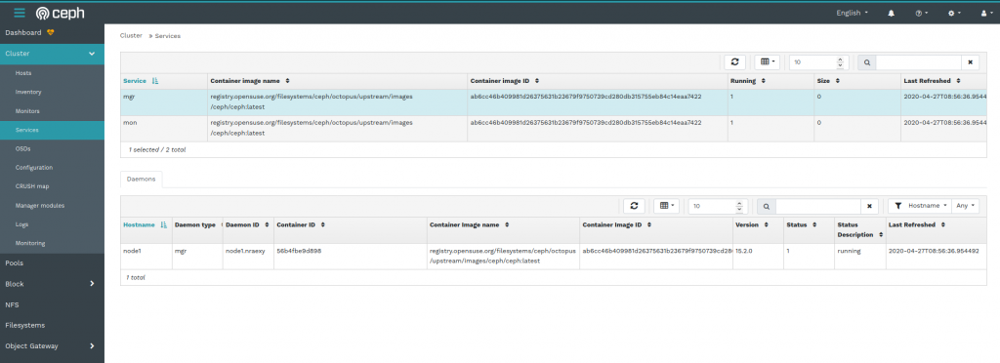
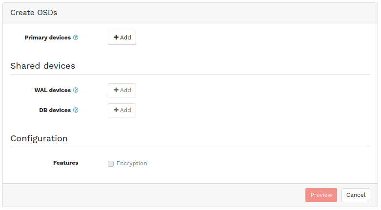
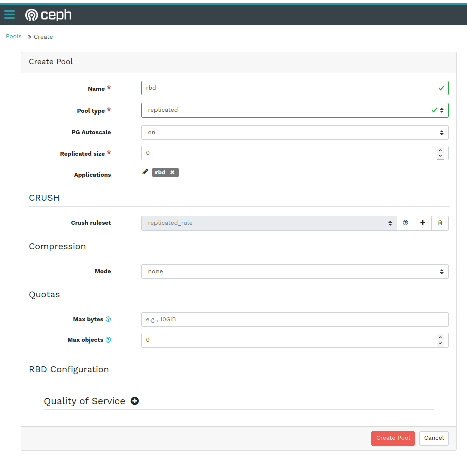
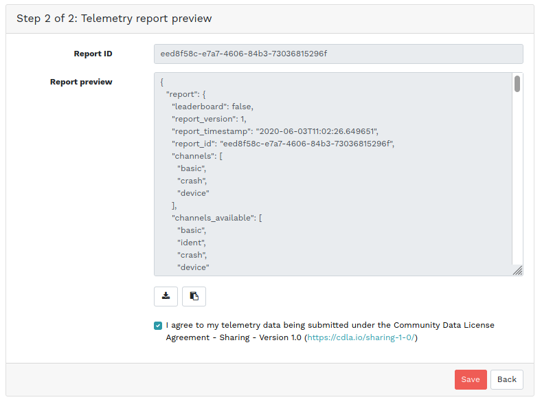

This is a follow-up to my previous blog post "[New in Octopus: Dashboard Enhancements](https://ceph.io/community/new-in-octopus-dashboard-enhancements/)" in which I highlighted some of the added and enhanced functionality related to Ceph Dashboard itself.

In this post I'd like to focus on the Ceph-specific new management features that have been added to the Dashboard during the Ceph Octopus development cycle.

One of the biggest improvements and new features in Ceph Octopus are likely [cephadm and the orchestrator integration](https://ceph.io/ceph-management/introducing-cephadm/). Starting with this Ceph release, it is now possible to deploy individual Ceph services like OSDs, Rados Gateway or iSCSI using Docker containers. This way, cephadm significantly simplifies the cluster deployment and management of services.

A number of new features in the Dashboard are dependent on this infrastructure to perform their work. Using this framework, the Dashboard can now also give you a much more detailed insight into your cluster's configuration.

For example, you can now display and filter this information from a per-host point of view, as well as from a device or service perspective.

Starting with Ceph Octopus, deploying new OSDs via cephadm will also be possible via the Dashboard.

Once a new host or new disk drives have been added to the inventory, you can now extend your existing cluster without having to use the command line interface.

Ceph Dashboard - Hosts List

The dashboard now has a new hosts page that displays hosts that are known to the cluster and allows you to view all devices and services that are running on each host.

For SMART-enabled devices, you can also obtain the individual health status and SMART data.

Ceph Dashboard - Host Inventory

The host inventory shows all disks attached to a selected host, as well as their type, size and other details.

Ceph Dashboard - Daemons Tab on Host Page

The "Deamons" tab on the host page shows all services that have been deployed on the selected host, which container they are running in and their current status.

All tables provide custom filters that enable you to further drill down into the data shown.

Ceph Dashboard - Inventory Page

The Inventory page aggregates the information of all storage devices attached to all nodes of your cluster, which OSD they are assigned to as well as other related information.

You can filter this output in various ways, for example by drive type, vendor or capacity.

Clicking the "Identify" button will help you finding the selected device in your data center, by making the disk enclosure LED blink for a customizable amount of time. This feature depends on [libstoragemgmt](https://libstorage.github.io/libstoragemgmt-doc/), which is an open source framework that provides a unified interface to perform this task on a wide range of hardware from different vendors.

Ceph Dashboard - Services Page

The Services page shown here gives you an overview about the various services that have been deployed as docker containers, as well as some more detailed information like the docker images they are based on, the Ceph version or their current runtime status.

Ceph Dashboard - Create OSDs Dialogue

Ceph Dashboard - Primary Device Selection Filter

The screen shots above show some parts of the new OSD creation workflow.

You start by creating a custom filter for your primary devices. All devices that match this filter will be used for the OSD creation process. You can filter by Type (SSD or HDD), Vendor, Model and Size. When using SSDs for shared devices, you can also select your WAL and DB devices in a similar step.

After you have defined your filters, you will see a preview and summary of the steps that will be performed. The OSD creation takes place in the background, while your cluster remains up and running.

The Ceph Pool Management page also received a number of updates.

Ceph Dashboard - Create Pool Dialogue

When creating a new pool, you can now define CRUSH placement rules to specify [device classes](https://ceph.io/community/new-luminous-crush-device-classes/), so you can create fast pools on SSDs only, for example. This helps in creating different tiers of storage pools easily, without having to make changes on the command line.

You can also define the [PG autoscaling mode](https://ceph.io/rados/new-in-nautilus-pg-merging-and-autotuning/) on a per-pool basis, either by choosing the cluster default, or selecting a different mode, e.g. disabling autoscaling or only emitting a warning when the pool's PG count is not ideal.

You can now also define [per-pool Quotas](https://docs.ceph.com/docs/octopus/rados/operations/pools/#set-pool-quotas) for both the amount of data in total or the number of objects that can be stored in a pool.

On the Object Gateway Management pages, we now support some new RGW features like [versioned buckets](https://docs.ceph.com/docs/master/radosgw/s3/bucketops/?highlight=versioning#enable-suspend-bucket-versioning), [multi-factor authentication](https://docs.ceph.com/docs/master/radosgw/mfa/#rgw-support-for-multifactor-authentication) and the selection of placement targets when creating buckets.

Ceph Dashboard - CephFS Client Eviction

The CephFS management page has also received a number of new features: it is now possible to disconnect or "[evict](https://docs.ceph.com/docs/octopus/cephfs/eviction/)" clients from the list of active sessions and to create [snapshots of a CephFS subtree](https://docs.ceph.com/docs/octopus/dev/cephfs-snapshots/) manually.

We also added support for managing [CephFS quotas](https://docs.ceph.com/docs/octopus/cephfs/quota/) and added a simple filesystem browser that allows you to traverse the file system's directory structure.

The existing iSCSI management pages were also improved, giving you more detailed insight into your active iSCSI gateways and initiators now. We also added some safeguards around deleting IQNs with active sessions.

We also further enhanced the integration with the Prometheus alert manager, which is a separate service you can deploy in your cluster. The dashboard now shows you all configured alerts, not just the current active ones.

Ceph Dashboard - Telemetry Configuration (Step 1/2)

Ceph Dashboard - Telemetry Configuration (Step 2/2)

Lastly, if you would like to enable the [submission of telemetry data](https://docs.ceph.com/docs/octopus/mgr/telemetry/) for your cluster, there is now a dedicated page/workflow for performing this task, including a preview of the data that is being transmitted back to the Ceph project.

While this was only a very brief overview that picked out some highlights, there have been much more changes and enhancements all across the Dashboard that are waiting be discovered by you.

If you haven't looked at Ceph Dashboard recently, consider giving it a try after updating to Ceph Octopus!

As usual, we are very eager on getting your feedback, feature requests and bug reports!
