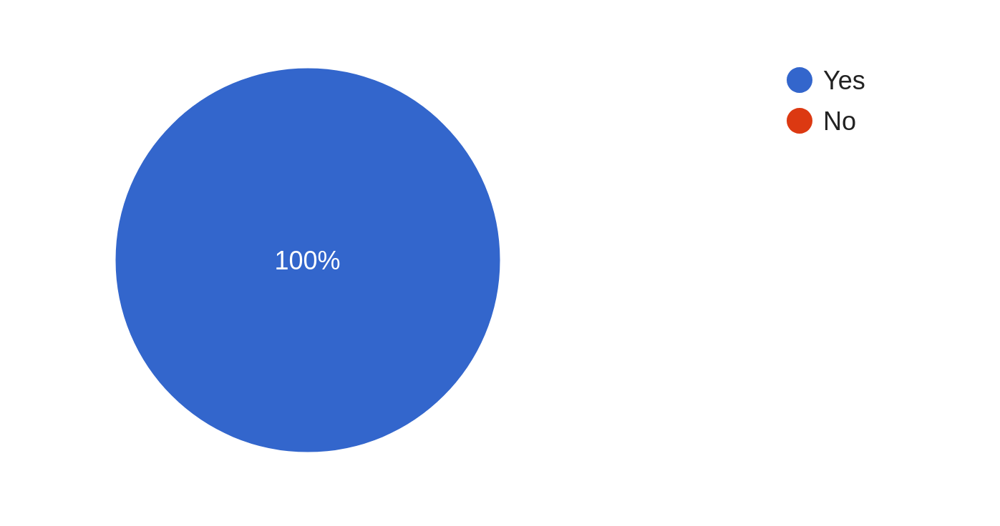
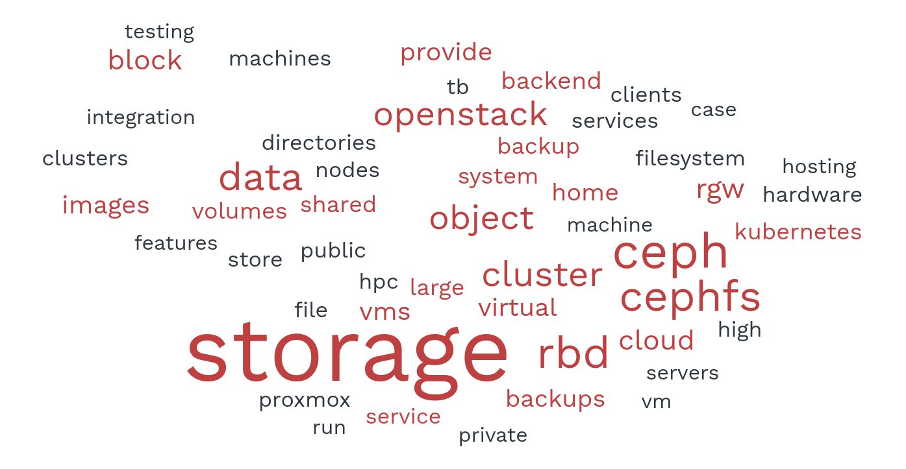

## Introduction

In October 2022, the Ceph project conducted a user survey to understand how people were using their Ceph clusters in the wild.
We asked people in the community of Ceph users, Ceph developers, and storage subject matter experts, **"What is the use case of your cluster?"**

With Ceph's features and user base continuously growing, the goal of the survey was to share updated use cases with the community. We also wanted
to make it easy for beginning developers (for example, students from [Google Summer of Code](https://summerofcode.withgoogle.com/),
[Outreachy](https://www.outreachy.org/), or the [Grace Hopper Celebration of Women in Computing](https://www.gracehoppercelebration.com/)) to
understand all the ways that Ceph can be used.

If you're curious about what you can use Ceph for, or you just want to know how other people are using Ceph, this blog post is for you.

## Survey Breakdown

We received a total of sixty-eight responses from the user / dev / sme-storage community.

### Question 1 was "Which of the following best describes you?"

- **61 people** (89.7%) identified as **Ceph users**
- **1 person** (1.5%) identified as a **Ceph developer**
- **6 people** (8.8%) specified **Other**, where they could type a more specific response:
    - **2 people** (2.9%) identified as **Ceph admins**
    - **1 person** (1.5%) identified as a **Ceph expert**
    - **1 person** (1.5%) elaborated that they were an **Integration engineer** who develops/maintains driver interfaces to CephFS in OpenStack and Kubernetes
    - **1 person** (1.5%) identified as an **opensource contributor**
    - **1 person** (1.5%) identified as a **large Ceph user + small Ceph developer**

Fig. 1: A pie-chart breakdown of survey participant descriptions
  
    
### Question 2 was "Do you have experience using a Ceph cluster(s)?"
    
- **68 people** (100%) responded **Yes**
- **0 people** (0%) responded **No**

Fig. 2: A pie-chart breakdown of the survey participants' cluster experience
  

### Question 3 was "Would you feel comfortable sharing the use case of your cluster(s) for us to potentially include in the Ceph website or documentation?"

- **58 people** (85.3%) responded **Yes**
- **10 people** (14.7%) responded **No**, at which point they were exited early from the survey

Fig. 3: A pie-chart breakdown of the survey participants' willingness to share their cluster use case publicly
  
    
## Use Cases

Of the sixty-eight total responses, fifty-eight people volunteered to share the use case of their cluster. We were pleased with the variety of responses we
received.

The figure above is a word cloud highlighting the most frequent key words from the users' responses.
  

### Several people reported using Ceph for research purposes.

- One anonymous Ceph user reported that they use CephFS as the backend of the [IRI Data Library](https://iri.columbia.edu/resources/data-library/), which is used
  to store about 700TB of climate, geophysical, health and agriculture data in multiple formats. They chose Ceph to handle the millions of data downloads their
  servers experience every month.
- Andrew Ferris wrote that Ceph is used as a large-scale storage solution at his research facility. As Andrew said, "Ceph's ability to run on cheaper commodity
  hardware and scalability is valuable to us."
- Lance Joseph reported that Ceph is used to serve large scale (+10 petabytes) turbulence and oceanography data sets for researchers and scientists. This data is
  backed by CephFS and S3 object storage.
- Mike Lowe mentioned using Ceph as backing storage for National Science Foundation researchers.

### Others reported using Ceph in testing and development environments.

- One anonymous Ceph user uses the S3 API to conduct local testing of applications and microservices.
- Kamil Madac reported that Ceph acts as OpenStack private cloud storage for a company with 100 employees. The private cloud is used for internal production VMs
  and for dev/test environments for apps that are developed.
- Kamoltat Sirivadhna, a Ceph developer, uses Ceph to develop features for the Ceph project.
- Goutham Pacha Ravi, an integration engineer who develops and maintains driver interfaces to CephFS in OpenStack and Kubernetes, uses Ceph for early integration testing.
- Open source developer Ngwa Secrick Meh uses Ceph clusters to develop features for the Ceph Dashboard component.

### Ceph users sometimes employ multiple interfaces at once.

Enrico Bocchi of CERN reported one such scenario.

CERN uses Ceph for block, object, and filesystem storage. The main use cases are:

- RBDs for OpenStack VMs (bootable volumes, storage volumes, glance images)
- RBDs for other storage services (for example, virtual machines attached to RADOS block devices to provide AFS and NFS, which are used as backend storage for other
  services)
- CephFS for provisioning of Persistent Volumes to Kubernetes / OKD pods (via Openstack Manila integration)
- CephFS as replacement for traditional networked POSIX filesystems (for example, NFS)
- CephFS for high-performance-computing (HPC) resources (a hyperconverged cluster that has storage and compute resources on the same servers)
- Object storage for container registries, GitLab artifacts, monitoring (prometheus, cortex)
- Object storage for world-wide software distribution via CVMFS (https://cernvm.cern.ch/fs/)
- Object storage as backup destination (S3-to-S3 with rclone, filesystem-to-S3 with restic)

### Quite a few users highlighted Ceph's *cost-effectiveness*, *availability*, *security*, and *resiliency* in their responses.

- Eneko Lacunza/Binovo reported using Ceph mainly for cost-effective HCI clusters.
- One anonymous Ceph user, who uses Ceph for HCP datasets and job outputs, reported that Ceph offers them high throughput storage and reliability in the case of heavy
  HPC IO, as well as high availability in the case of an unexpected datacenter loss.
- Andreas Haase likes the high-availability of Ceph's block storage, and uses it in a VMWare environment.
- Another anonymous Ceph user wrote that they provide S3 storage for customers who need a very high degree of data protection from human and natural disasters.
- An anonymous Ceph user reported being able to run Ceph as resilient block, object, and filesystem storage on affordable hardware in their homelab.

### One distinction to make about Ceph, as revealed by some users, is that it has both *public* and *private* use cases.

- Konstantin Shalygin, a Ceph Engineer from Selectel, reports that his company uses Ceph to provide Cloud Server & Cloud Storage services.
  These services are both available to the public and used privately within the company.
- Foysal Kayum uses RBD pools for serving a public cloud service.
- An anonymous Ceph user wrote that they use Ceph to support private and hybrid cloud infrastructure testing.
- An anonymous participant, who described themself as a "large Ceph user + small Ceph developer", wrote that they use Ceph as a public cloud with RBD- and RGW-based products.

### To conclude this section, I'll touch on some "wild card" use cases that prove Ceph can be used in pretty much any situation!

- One anonymous Ceph user reported using a CephFS filesystem for a nonprofit organization to store large video files. They emphasized the need for their system to be resilient
  and able to cope with hardware failures, as there are not always technicians on hand.
- Alex Kernshaw of Microsoft uses Ceph as a data store for a geographically redundant voicemail server. CephFS, S3 with multisite, and Pubsub are the components that back his use case.
- Another anonymous Ceph user reported using Ceph as a storage layer for their homelab, where CepFS serves as a remote filesystem.
- Eugen Block reported using CephFS as working and home directories for his company, as well as using RBD for OpenStack and S3 backups for Kubernetes.

## Conclusion

We'd like to thank everyone in the community for their participation. Thank you for choosing Ceph! Send all questions regarding the survey to <lflores@redhat.com>.
