## Introduction

This comparison study is a follow-up to a [study](../../2021/qos-study-with-mclock-and-wpq-schedulers/) where mClock was tested with client ops and only recovery/backfill ops going on in the background. The goal in this study is to optimize the QoS parameters for the *background best effort* class of ops in the existing mClock profiles. To achieve this, tests were performed with optimizations made to the QoS parameters for the best effort class of operations that includes ops like scrub and snaptrim. Part 1 of this blog discusses the methodology used and presents results of tests with snaptrim and recovery ops using the optimized QoS parameters that worked well.

In addition, towards the end of the blog, results from testing mClock with client ops and recovery/backfill ops on a logically scaled cluster is presented.

## Overview

For each scheduler, the tests involved running client ops on a RBD pool with the following background operations:

- Test A: Snaptrim ops on a separate pool
- Test B: Background recovery and snaptrim ops in parallel on separate pools.

The results were collated and the following statistics were compared between the two schedulers for the following operation types:

- External client
    - Average throughput (IOPS)
    - Average completion and percentile (95th, 99th, 99.5th) latencies
- Background recovery
    - Average recovery throughput
    - Number of misplaced objects recovered per second
- Background snaptrim
    - Average snaptrim rate
    - Number of objects trimmed

## Test Environment

A single node with the following configuration was used for the tests:

- **Software Configuration**: CentOS 8.1.1911 Linux Kernel 4.18.0-193.6.3.el8_2.x86_64
- **CPU**: 2 x Intel® Xeon® CPU E5-2650 v3 @ 2.30GHz
- **nproc**: 40
- **System Memory**: 64 GiB
- **Tuned-adm Profile**: network-latency
- **Ceph Version**: 17.0.0-12483-g307e20ec647 (307e20ec64724620831e1c3f0ad806562c80592a) quincy (dev)
- **Storage**: Intel® NVMe SSD DC P3700 Series (SSDPE2MD800G4) [4 x 800GB]

All the Ceph pools were configured with a replication factor of 3. A total of 4 OSDs were configured on the node for the tests.

## Test Methodology

Ceph [cbt](https://github.com/ceph/cbt) was used to test the scenarios. A new test to generate background snaptrim ops and recovery ops with client I/Os in parallel was created. The test was first executed 3 times with the Weighted Priority Queue (WPQ) scheduler. This provided a baseline to compare against.

After this, the same test was executed with mClock scheduler and with different mClock profiles, i.e. *high_client_ops*, *balanced* and *high_recovery_ops*. The results collated for comparison. The test was executed 3 times for each mClock profile, and the average of those runs are reported in this study.

## Establish Baseline Client Throughput (IOPS)

For the tests, NVMe SSDs were used as the backing device for the OSDs. A 1:1 mapping of an OSD to the device was set up. But before the actual tests, the baseline throughput was established by running a 100% 4KiB random write ‘fio’ benchmark on a single RBD pool configured with the same OSDs to be used in the tests, and with a replication factor of 3. An average baseline client throughput of around 23K IOPS (91 MiB/s) @ 4KiB random writes was established. The bluestore throttle parameters, namely `bluestore_throttle_bytes` and `bluestore_throttle_deferred_bytes` were determined to be 256 KiB using these [steps](https://docs.ceph.com/en/latest/rados/configuration/mclock-config-ref/#steps-to-manually-benchmark-an-osd-optional) (Note that ‘fio’ tool was used instead of OSD bench).

| Device Type | Number of OSDs | RBD Pool Configuration | Baseline Throughput (@4KiB Random Writes, QD: 64) |
| :---: | :---: | :---: | :---: |
| NVMe SSD | 4 | *Replication Factor*: 3 *pg_num & pgp_num*: 64 | 23323.71 IOPS (91.11 MiB/s) |

The OSD capacity determination was left to the automated procedure. This represents the raw capacity of an individual OSD and is usually higher. This is used by the mClock profiles to calculate the QoS allocations for each class of service in the OSDs (client, recovery and other background ops).

## mClock Profile Allocations

The low-level mClock shares per profile are shown in the tables below. For parameters like reservation and limit, the shares are represented as a percentage of the raw OSD capacity. For example, in the *high_client_ops* profile, the reservation parameter is set to 50% of the raw OSD capacity. These allocations are made under the hood once a profile is enabled. The weight parameter is unitless. See [QoS Based on mClock](https://docs.ceph.com/en/latest/rados/configuration/osd-config-ref/#dmclock-qos) for more details on mClock QoS parameters.

For the tests, a lot of experimentation with the profile allocations for the “background best effort” clients was performed before arriving at the values outlined in the following tables.

### Profile - high_client_ops (default)

This profile allocates more reservation and limit to external clients ops when compared to recovery and other background ops within Ceph. This profile is enabled by default.

| Service Type | Reservation | Weight | Limit |
| :---: | :---: | :---: | :---: |
| client | 50% | 2 | MAX |
| background recovery | 25% | 1 | 100% |
| background best effort | 25% | 1 | 30% |

### Profile - high_recovery_ops

This profile allocates more reservation to recovery ops when compared to external clients and other internal ops within Ceph. For example, an admin may enable this profile temporarily to speed-up background recoveries during non-peak hours.

| Service Type | Reservation | Weight | Limit |
| :---: | :---: | :---: | :---: |
| client | 30% | 1 | 80% |
| background recovery | 60% | 2 | 200% |
| background best effort | 10% | 1 | 40% |

### Profile - Balanced

This profile allocates equal reservations to client ops and background recovery ops. The internal best effort client gets a slightly lower reservation and a limit of 50% so that they can still complete fairly quickly if there are no competing services.

| Service Type | Reservation | Weight | Limit |
| :---: | :---: | :---: | :---: |
| client | 40% | 1 | 100% |
| background recovery | 40% | 1 | 150% |
| background best effort | 20% | 1 | 50% |

## mClock Configuration Parameters

The mClock-related configuration options are set transparently when any built-in profile is selected. For more information on what configuration options are overridden in the profiles, see the section titled [mClock Built-in Profiles](https://docs.ceph.com/en/latest/rados/configuration/mclock-config-ref/#mclock-built-in-profiles).

## Other Ceph Configuration Parameters

It is important to note the values for the following Ceph recovery-related options overridden by the mClock profiles:

- **osd_max_backfills** = 1000
- **osd_recovery_max_active** = 1000

The above options set a high limit on the number of concurrent local and remote backfill/recovery operations per OSD. Under these conditions, the capability of the mClock scheduler was tested, and the results are presented below.

The Ceph configuration options related to snaptrim that were left unchanged are shown below:

- **osd_pg_max_concurrent_snap_trims** = 2
- **osd_snap_trim_cost** = 1048576

## Client Ops with Background Snaptrim Ops

### Test Steps

1. Bring up the Ceph cluster with 4 osds.
2. Disable pg autoscaler and scrubs.
3. Create a client RBD pool with replication factor 3 and prefill some objects in it.
4. Create a RADOS snap pool with replication factor 3.
5. Prefill the snap pool with 100K 4MiB sized objects.
6. Create a RADOS pool snapshot of the snap pool.
7. Overwrite 80% of the objects in the snap pool. This creates 80K clone objects.
8. Initiate I/O on the client pool for 300 secs using fio
9. After client I/Os have stabilized for 30 secs, remove the snapshot created in step 6. This triggers the removal of the 80K clone objects as part of the snaptrim operation.
10. During step 9 above, statistics related to the client latency and throughput are captured. The test also captures the time taken to trim the 80K objects.

To summarize, the steps above create 2 pools during the test. Snaptrim is triggered on one pool, and client I/O is triggered simultaneously on the other. Statistics captured during the tests are discussed below.

### Test Results

#### Client Throughput Comparison

The chart below shows the average client throughput comparison across the schedulers and their respective configurations. The average baseline throughput with both the schedulers was determined to be just over 23K IOPS (4KiB randrw) using fio on the client RBD pool.

[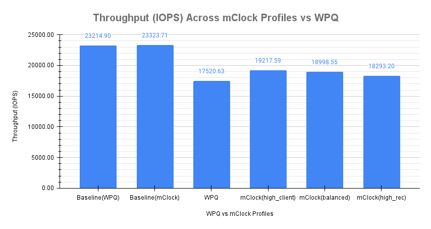](images/Img1_Throughput_Across_mClock_Profiles_vs_WPQ.png)

Fig. 1: WPQ vs mClock Profiles - Average Client Throughput Comparison With Snaptrim Ops
 

The client throughput shown is the average throughput reported by fio during the course of the test (300 secs). It is important to note that the snaptrim duration forms a subset of the client I/O run time.

The average client throughput using the WPQ scheduler with default Ceph configuration was 17520.63 IOPS, which is nearly 25% lower than the baseline(WPQ) throughput. But with the mClock scheduler and with the default *high_client_ops* profile, the average client throughput was nearly 10% higher at 19217.59 IOPS when compared to the WPQ scheduler. This meets the minimum reservation criteria of 50% set for client ops in the mClock profile.

The chart also shows the overall client throughput reported with the other mClock profiles. Due to lower reservations allocated to client ops in the other mClock profiles, lower throughputs on the clients are expected. With the *balanced* profile, an average throughput of 18998.55 IOPS (8.4% higher compared to WPQ) was obtained. With the *high_recovery_ops* profile, it was 18293.20 IOPS (4.4% higher compared to WPQ).

This demonstrates that mClock is able to provide the desired QoS for the client with concurrent background snaptrim operations in progress. The average client throughputs with the mClock profiles are higher when compared to the WPQ scheduler.

#### Client Latency Comparison

Fig. 2 below shows the average completion latency (clat) along with the average 95th, 99th and 99.5th percentiles across the WPQ scheduler and the mClock scheduler profiles. In addition, a more accurate measure of the average clat observed during the time snaptrim operations were active is also shown. This is represented as *clat (snaptrim)* in the chart. This shows the effectiveness of mClock profiles over the WPQ scheduler in providing relatively similar average client latencies, but different snaptrim rates. The noticeable differences are in the percentile latencies [95th, 99th, 99.5th] with the *high_client_ops* showing the lowest as expected.

[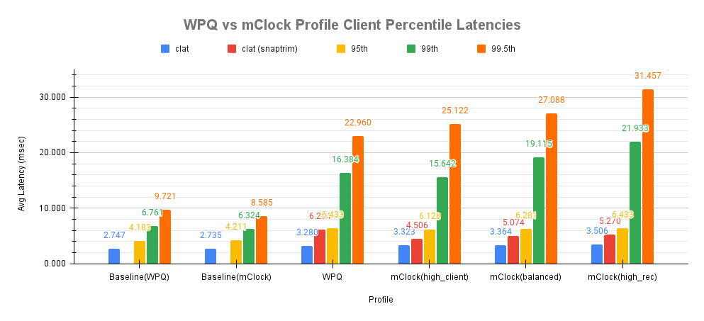](images/Img2_WPQ_vs_mClock_Profile_Client_Pct_Lat.png)

Fig. 2: WPQ vs mClock Profiles - Average Client Latency and Percentile Comparison With Snaptrim Ops
 

The overall average client completion latency obtained with WPQ was 3.280 msec. However, during the snaptrim phase, the average client completion latency was 6.2 msec which is an increase of nearly 126% when compared to the baseline value of 2.747 msec!

With mClock *high_client_ops* profile, the overall average completion latency was slightly higher at 3.323 msec. But during the snaptrim phase, the average completion latency was 4.506 msec which is over 27% lower than what was observed with WPQ. The table below shows the latency comparison between WPQ and mClock schedulers.

| mClock Profile | Overall clat (msec) | WPQ Comparison (3.280 msec) | clat during snaptrim(msec) | WPQ Comparison (6.2 msec) |
| :---: | :---: | :---: | :---: | :---: |
| high_client_ops | 3.323 | 1.3% higher | 4.506 | 27% lower |
| balanced | 3.364 | 2.6% higher | 5.074 | 18% lower |
| high_recovery_ops | 3.506 | 6.9% higher | 5.270 | 15% lower |

With the other profiles like *balanced* and *high_recovery_ops*, the overall average client completion latency increased marginally to 3.364 msec and 3.506 msec respectively. During the snaptrim phase, with the *balanced* profile, the average clat was 5.074 msec during snaptrim phase, which is 18% lower than what was observed with WPQ scheduler. With the *high_recovery_ops* profile, it was 5.270 msec, which is around 15% lower than what was observed with WPQ scheduler.

A comparison of the average client latency variations during snaptrim ops with WPQ and mClock profiles is shown during a couple of test runs in Fig. 3 and Fig. 4. These charts track how the average client completion latency is affected during snaptrims ops.

[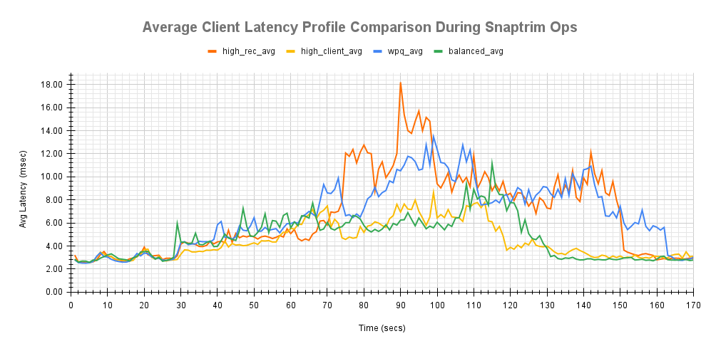](images/Img3_Avg_Client_Lat_Profile_Cmp_During_Snaptrim_Ops.png)

Fig. 3: WPQ vs mClock Profiles - Average Client Latency Comparison During Snaptrim Ops
 

The latencies in both the charts can be seen to increase after 30 secs into the client I/O when snaptrim ops were triggered. Although there are intermediate latency spikes across the mClock profiles, they are predominantly lower than the WPQ latency profile.

Fig. 4: WPQ vs mClock Profiles - Average Client Latency Comparison During Snaptrim Ops
 

Therefore, it can be concluded that mClock scheduler is able to provide significantly higher throughputs and lower latencies to client ops during snaptrim operations. But is there any impact to the snaptrim rate and duration? The following section analyzes this.

#### Snaptrim Rate Comparison

Another important metric to consider is how the snaptrim rate and time are affected by the mClock profiles and how they compare against the WPQ scheduler.

Fig. 5 shows that with the WPQ scheduler, the average snaptrim rate was 671 objects/sec with an average snaptrim duration of 121.83 secs for 80K objects.

With the mClock *high_client_ops* profile, the average snaptrim rate was 747 objects/sec with an average snaptrim duration of 111.34 secs for trimming the same number of objects. This means that the mClock scheduler is able to complete the snaptrim operations 8.6% faster on average and with 27% lower average latency compared to the WPQ scheduler! This can be attributed to the highest reservation allocation of 25% of the OSD capacity to the best effort class in this profile which includes snaptrim ops.

Fig. 5: WPQ vs mClock Profiles - Average Snaptrim Rate and Duration
 

With the mClock *balanced* profile, the average snaptrim rate was the highest at nearly 804 objects/sec with a corresponding highest average snaptrim duration of 100 secs. This can be attributed to the highest limit allocation of 50% of OSD capacity for snaptrim ops. In this case the mClock scheduler is able to complete the snaptrim operations nearly 18% faster on average and with 20% lower average latency compared to the WPQ scheduler!
The numbers with mClock *high_recovery_ops* profile are in-between with a snaptrim rate of 766 objects/sec with an average snaptrim duration of 108 secs. This again can be attributed to the best effort reservation(10%) and limit(40%) settings.

[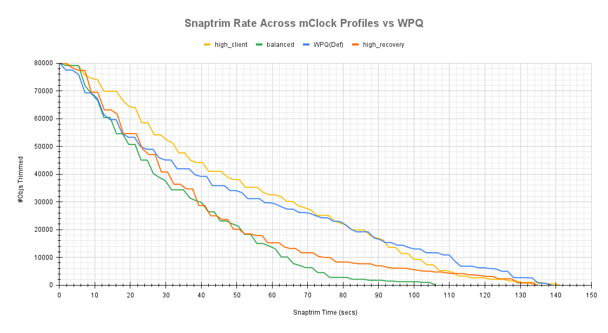](images/Img6_Snaptrim_Rate_Across_mClock_Profiles_vs_WPQ.png)

Fig. 6: WPQ vs mClock Profiles - Snaptrim Rate
 

Another interesting graphic to look at is how the snaptrim rate with WPQ scheduler compares with the mClock scheduler profiles. The plots in Fig. 6 and Fig. 7 show the comparison over time for a couple of test runs. The plots clearly show the snaptrim rate with *high_client_ops* profile to initially progress slower than WPQ scheduler and other mClock profiles. Sometime after the halfway mark, the snaptrim rate with the *high_client_ops* profile overtakes the WPQ rate.

[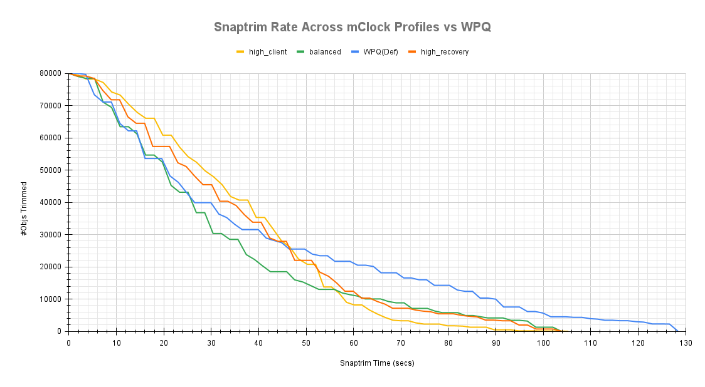](images/Img7_Snaptrim_Rate_Across_mClock_Profiles_vs_WPQ.png)

Fig. 7: WPQ vs mClock Profiles - Snaptrim Rate
 

The plots also show that the snaptrim rate of the *balanced* and *high_recovery_ops* profiles progress faster than the *high_client_ops* profile. As already indicated earlier, this can be attributed to the higher limits allocation for the snaptrim ops and also because there are no competing ops like recovery, scrubs and other background ops.

#### Snaptrim Effect on Client Latency
To better understand the effect of snaptrim ops on client latency, the plots shown below overlays the client latency profile against the snaptrim rate. This shows the client latency variations during the snaptrim phase.

These plots were useful during the experimental phase to determine the reservation, weight and limit allocation for the best effort class of operations. They were used to verify if snaptrim ops were negatively impacting client ops with the allocations and help make incremental changes to the profile.

[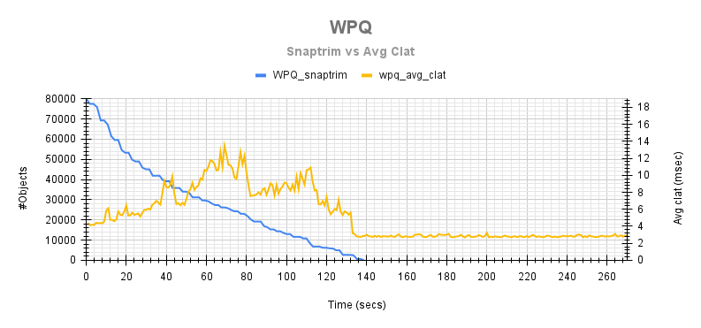](images/Img8_WPQ_Snaptrim_Rate_vs_Avg_Clat.png)

Fig. 8: WPQ - Average Client Latency Variations During Snaptrim Ops
 

[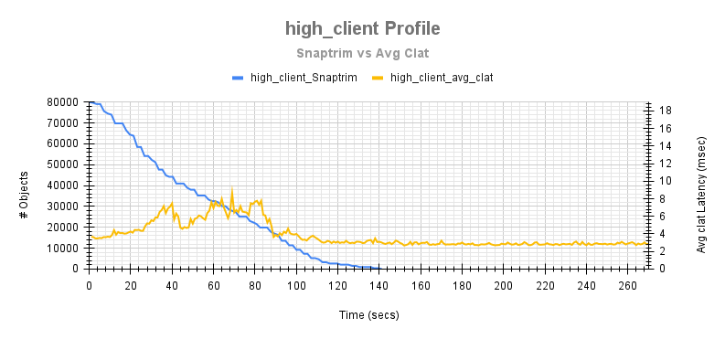](images/Img8a_high_client_Profile_Snaptrim_Rate_vs_Avg_Clat.png)

Fig. 8a: high_client_ops - Average Client Latency Variations During Snaptrim Ops
 

The plots above give an example of how the client latency varies during the snaptrim phase between the WPQ scheduler and the *high_client_ops* mClock profile. It can easily be discerned that with the *high_client_ops*, the latency spikes and the magnitude of variations are much lower than the WPQ scheduler.

## Client Ops with Snaptrim & Recovery Ops

### Test Steps

1. Bring up the Ceph cluster with 4 osds.
2. Disable pg autoscaler and scrubs.
3. Create a client RBD pool with replication factor 3 and prefill some objects in it.
4. Create a RBD recovery pool with replication factor 3.
5. Mark an OSD down and out. After the cluster handles the OSD down event, 30K 4MiB objects are pre-filled into the recovery pool.
6. Create a RADOS snap pool with replication factor 3.
7. Temporarily disable recovery and backfill ops.
8. Bring up the downed OSD from step 5
9. Prefill the snap pool with 70K 4MiB sized objects.
10. Create a RADOS pool snapshot of the snap pool.
11. Overwrite 100% of the objects in the snap pool. This creates 70K clone objects.
12. Initiate I/O on the client pool for 300 secs using fio
13. After client I/Os have stabilized for 30 secs, remove the snapshot created in step 10. This triggers the removal of the 70K clone objects as part of the snaptrim operation.
14. At the same time, enable recovery and backfill ops (disabled in step 7). This triggers the backfill of misplaced objects.
15. Statistics related to the client latency and throughput are captured. The test also captures the time taken to trim the 70K objects and time taken to recover the total misplaced objects.

To summarize, the steps above create 3 pools during the test. Snaptrim, recovery and client ops are simultaneously triggered on separate pools. Statistics captured during the tests are discussed below.

### Test Results

#### Client Throughput Comparison

Fig. 9 shows the average client throughput comparison across the schedulers and their respective configurations. The average baseline throughput with both the schedulers was determined to be around 23K IOPS (4KiB randrw) using fio on the client RBD pool.

Fig. 9: WPQ vs mClock Profiles - Average Client Throughput Comparison During Snaptrim+Recovery Ops
 

The client throughput shown is the average throughput reported by fio during the course of the test. It is important to note that both recovery/backfill and snaptrim durations form a subset of the client I/O run time.

The average client throughput using the WPQ scheduler with default Ceph configuration was 12939.71 IOPS, which is 43% lower than the baseline(WPQ) throughput. But with the mClock scheduler and with the default *high_client_ops* profile, the average client throughput is around 5.5% higher than the average throughput seen with WPQ scheduler at 13651.66 IOPS. This meets the minimum reservation criteria of 50% set for client ops in the mClock profile.

The chart also shows the overall client throughput reported with the other mClock profiles. Due to lower reservations allocated to client ops in the other mClock profiles and with background recoveries and snaptrims active, significantly lower throughputs on the clients are expected. Therefore, with the *balanced* profile, an average throughput of 10541.26 IOPS was obtained. This is 45% of the baseline(mClock) throughput. Finally, with the *high_recovery_ops* profile, it was 9168.12 IOPS which is around 39% of the baseline(mClock) throughput. This shows that the minimum reservation criteria is being met for the mClock profiles.

This demonstrates that mClock is able to provide the desired QoS for the client with background snaptrim and recovery operations in progress.

#### Client Latency Comparison

The chart below shows the average completion latency (clat) along with the average 95th, 99th and 99.5th percentiles across the WPQ scheduler and the mClock scheduler profiles. In addition, a more accurate measure of the average clat observed during the time snaptrim and recovery operations were active is also shown. This is represented as clat (trim+rec) in the chart. This shows the effectiveness of mClock profiles over the WPQ scheduler.

[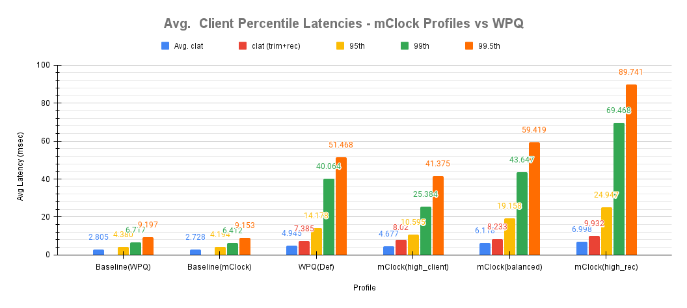](images/Img10_Avg_Client_Pct_Lat_mClock_Profiles_vs_WPQ.png)

Fig. 10: WPQ vs mClock Profiles - Avg Client and Percentile Latency Comparison During Snaptrim+Recovery Ops
 

The overall average client completion latency obtained with WPQ was 4.945 msec. However, during the snaptrim phase, the average client completion latency was 7.385 msec which is an increase of over 163% when compared to the baseline value of 2.805 msec!

With mClock *high_client_ops* profile, the overall average completion latency was slightly lower at 4.677 msec. But during the snaptrim and recovery phases, the average completion latency was 8.02 msec which is 8.6% higher than seen with WPQ scheduler. This can be attributed to the higher bandwidth allocation to snaptrim ops. The table below shows the latency comparison between WPQ and mClock schedulers.

| mClock Profile | Overall clat (msec) | WPQ Comparison (4.945 msec) | clat during snaptrim+rec(msec) | WPQ Comparison (7.385 msec) |
| :---: | :---: | :---: | :---: | :---: |
| high_client_ops | 4.677 | 5.6% lower | 8.020 | 8.6% higher |
| balanced | 6.118 | 23.7% higher | 8.223 | 11.4% higher |
| high_recovery_ops | 6.998 | 41.5% higher | 9.932 | 34.5% higher |

With the other profiles like *balanced* and *high_recovery_ops*, the overall average client completion latency increased significantly to 6.118 msec and 6.998 msec respectively. During the snaptrim and recovery phase, the average clat was even higher in the range of 11% to 34% when compared to the WPQ scheduler as shown in the table. This is expected due to the higher limits set in these profiles to recovery and snaptrim ops. In the subsequent sections it can be seen that the higher limits help in speeding up the background ops at the cost of higher client latencies.

A comparison of the average client latency variations during snaptrim and recovery ops with WPQ and mClock profiles is shown during one of the test runs below. This tracks how the average client completion latency is affected at different points during background ops.

[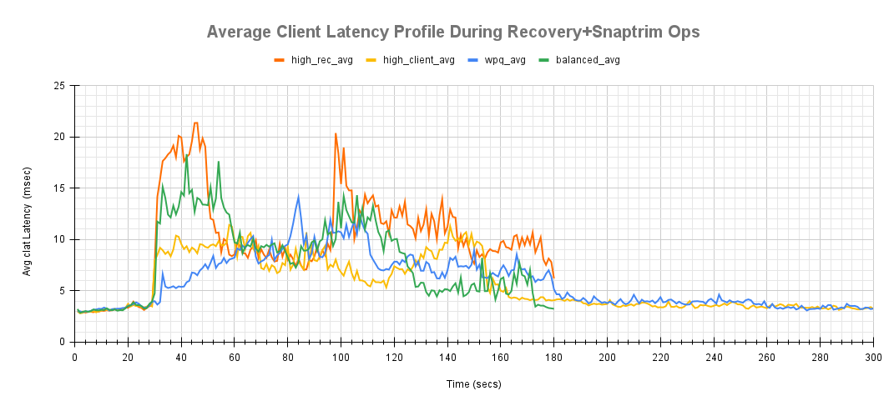](images/Img11_Avg_Client_Lat_Profile_During_Rec_Snaptrim_Ops.png)

Fig. 11: WPQ vs mClock Profiles - Average Client latency Comparison During Snaptrim+Recovery Ops
 

The latency with *high_client_ops* is seen to increase initially when the background ops start after 30 secs into the client I/O. The initial latency is higher than what is seen with WPQ scheduler likely because of the higher snaptrim throughput allowed by the mClock profile. Eventually, the average client latency falls lower than WPQ in the middle phase and the benefit of mClock can be clearly seen here as client ops are given more preference owing to the high limit and weight.

#### Snaptrim Rate Comparison

The snaptrim rate and time are affected by the mClock profiles and the charts below show how they compare against the WPQ scheduler.

With the WPQ scheduler, the average snaptrim rate was approximately 431 objects/sec with an average duration of 164.24 secs for trimming 70K objects.

With the mClock *high_client_ops* profile, the average snaptrim rate was approximately 528 objects/sec with an average snaptrim duration of 133.59 secs for trimming the same number of objects. This means that the mClock scheduler is able to complete snaptrim operations 18.7% faster on average and with only an 8.6% higher average client latency compared to the WPQ scheduler. This can be attributed to the highest reservation allocation of 25% of the OSD capacity to the best effort class in this profile.

[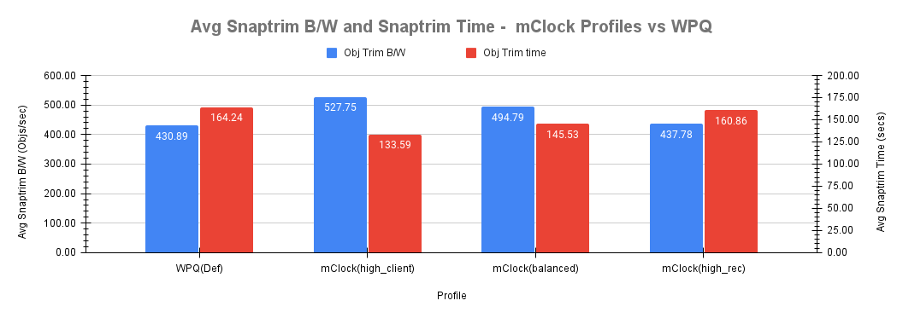](images/Img12_Avg_Snaptrim_BW_and_Time_mClock_Profiles_vs_WPQ.png)

Fig. 12: WPQ vs mClock Profiles - Average Snaptrim B/W and Snaptrim Duration Comparison
 

With the *balanced* profile, the average snaptrim throughput comes down to around 495 objects/sec due to lower reservation and consequently a higher snaptrim duration. The same applies to the *high_recovery_ops* profile as well with the lowest average snaptrim throughput and the highest average snaptrim duration.

Fig. 13: WPQ vs mClock Profiles - Snaptrim Rate Comparison
 

The snaptrim rate comparison plot in Fig. 13 clearly show the snaptrim rate with *high_client_ops* profile initially progresses slower than WPQ scheduler. Sometime before the halfway mark, the snaptrim rate with the *high_client_ops* profile overtakes the WPQ rate.

With the other mClock profiles, things are different with recoveries going on in parallel. The initial snaptrim rates with the *balanced* and *high_recovery_ops* profile are slightly slower in comparison due to the lower reservation allocation. The rate picks up marginally due to higher limit allocation and gets throttled back again towards the end and eventually completes much later than the *high_client_ops* profile.

#### Recovery Rate Comparison

Another major aspect of the test is to analyze how the recovery ops are affected by mClock profiles by establishing metrics like recovery throughput, recovery times and their impact to client ops. As seen in the bar chart below, the *high_client_ops* profile has the biggest impact on recovery ops. This is expected due to the lowest reservation allocation to background recoveries. The average recovery throughput and times are similar to what is seen with the WPQ scheduler with 83 objects/sec and 224 secs respectively.

[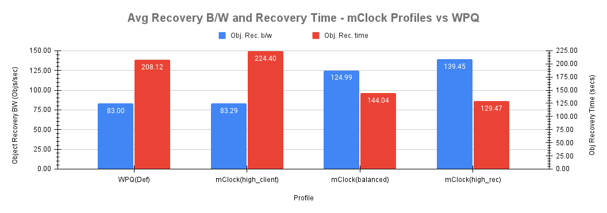](images/Img14_Avg_Recovery_BW_and_Time_mClock_Profiles_vs_WPQ.png)

Fig. 14: WPQ vs mClock Profiles - Average Recovery B/W and Recovery Time Comparison
 

Fig. 15 shows the recovery rates between WPQ scheduler and mClock profiles.

Fig. 15: WPQ vs mClock Profiles - Recovery Rate Comparison
 

The *high_recovery_ops* profile as expected has the highest average recovery throughput of nearly 140 objects/sec and the lowest average recovery time of nearly 130 secs to recover around 18K objects.

The *balanced* profile provides a good middle ground by allocating the same reservation and weight to client and recovery operations. The recovery rate curve falls between the *high_recovery_ops* and *high_client_ops* curves with an average throughput of almost 125 objects/sec and taking an average of 144 secs to complete the recovery.

#### Snaptrim + Recovery Effect on Client Latency

To understand the effect of snaptrim and recovery ops on client latency, the plots shown below overlays the client latency profile against the snaptrim and recovery rate during a test run.

Fig. 16: WPQ - Avg Client Latency Variations During Recovery+Snaptrim Ops
 

The plots shown below provide an understanding of how the client latency varies during the snaptrim and recovery phase between the WPQ scheduler and the mClock profiles. It can easily be discerned that with the *high_client_ops*, the average client latency is on a slightly higher side until the snaptrim ops complete. It is evident that the snaptrim rate curve with the *high_client_ops* profile is steeper than the rate with the WPQ scheduler and this is the reason for the marginally high (8.6%) average client latency. But on the other hand, the average snaptrim rate is faster by around 18.7%.

For the *balanced* and *high_recovery_ops* profiles, the recoveries can be seen to complete faster with a corresponding impact to the snaptrim and client ops. This is due to the nature of the QoS reservation and limit allocation to the client and best effort op classes in these profiles.

[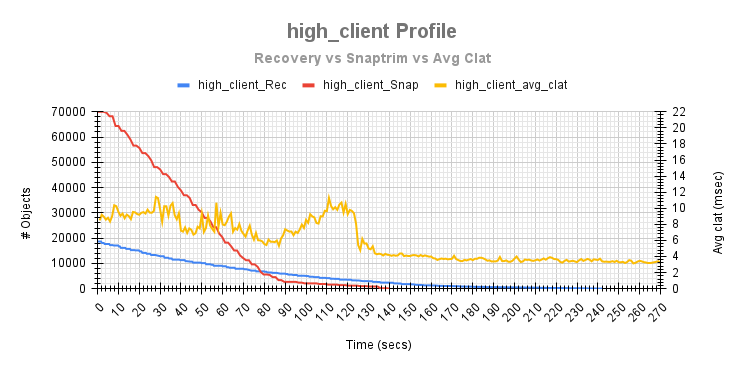](images/Img17_high_client_Profile_Rec_vs_Snaptrim_vs_Avg_Clat.png)

Fig. 17: high_client_ops - Avg Client Latency Variations During Recovery+Snaptrim Ops
 

[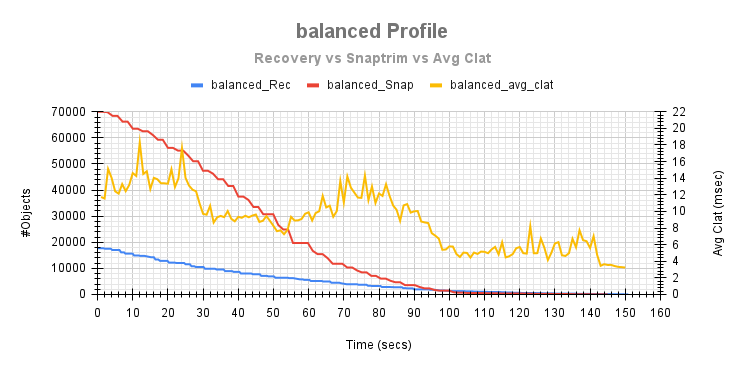](images/Img18_balanced_Profile_Rec_vs_Snaptrim_vs_Avg_Clat.png)

Fig. 18: balanced - Avg Client Latency Variations During Recovery+Snaptrim Ops
 

[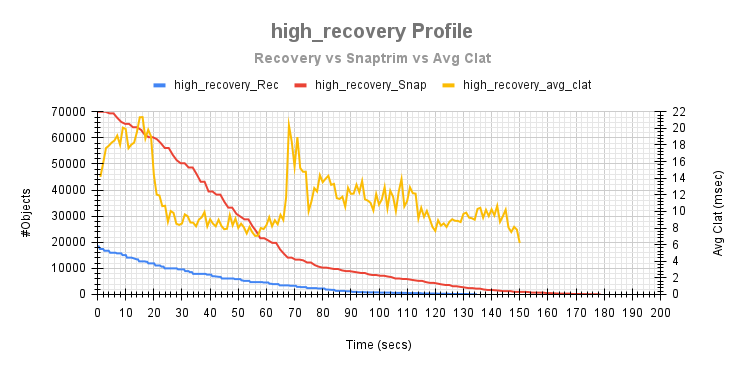](images/Img19_high_recovery_ops_Profile_Rec_vs_Snaptrim_vs_Avg_Clat.png)

Fig. 19: high_recovery_ops - Avg Client Latency Variations During Recovery+Snaptrim Ops
 

## Scaled Cluster: Client Ops & Recovery

### Test Environment

One of the objectives was to test mClock in a scaled environment with an intention to test the effectiveness of mClock profiles and identify any scale related issues. For this purpose, a large-scale test cluster called the Gibba cluster backed by Cephadm was used. The scaled cluster had a total of 975 OSDs (SSD) and 40 hosts with 13 TiB of raw capacity. But for the recovery test, a total of 3 hosts each hosting 25 OSDs was employed. Also, 3 RBD pools (1 pre-existing with ~100 Million 4KiB Objects, 1 pool for client ops and 1 recovery pool with 100K 4 MiB objects) were used for the test. All the Ceph pools were configured with a replication factor of 3. One OSD from each host was restarted to trigger recovery of misplaced objects. Put together, around 650K-730K Objects were recovered during the tests and stats were collected and compared across the mClock profiles. Tests with WPQ scheduler are pending and are not discussed in this blog. The configuration of each node is shown below:

- **Software Configuration**: CentOS Stream 8 Linux Kernel 4.18.0-301.1.el8.x86_64
- **CPU**: Intel® Xeon® E-2278G CPU @ 3.40GHz
- **nproc**: 16
- **System Memory**: 32 GiB
- **Ceph Version**: quincy (dev)
- **Storage**: Intel® NVMe DC P4801X Series (SSDPEL1K375GA)

### Test Steps

1. On the scaled cluster disable pg autoscaler and scrubs.
2. Create a client RBD pool with replication factor 3 and prefill some objects in it.
3. Create a RBD recovery pool with replication factor 3.
4. Mark an OSD down and out.
5. After the cluster handles the OSD down event, prefill 100K 4MiB objects into the recovery pool.
6. Bring up the downed OSD from step 5. This triggers Recovery and backfill ops.
7. At the same time initiate I/O on the client pool for 500 secs using fio
8. Stats relating to client ops, recovery time and number of misplaced objects are tracked by the test for later analysis.

### Test Results

#### Client Throughput Comparison

The raw throughput capacity of an OSD was determined to be around 60K IOPS (4KiB randrw). To mitigate memory saturation and its aftereffects on the OSD nodes when clients were performing at max throttle, the `osd_mclock_max_capacity_iops_ssd` for each OSD was set to ~50% of the raw throughput i.e. 30K IOPS. The results from one of the clients nodes (Gibba010) is discussed below.

The average baseline throughput was measured to be ~65326 IOPS. Fig. 20 below shows the average client throughput comparison across mClock profiles during a test run on the client node Gibba010.

Fig. 20: mClock Scaled Testing - Average Client Throughput Comparison
 

The *high_client_ops* profile shows the highest throughput (~64000 IOPS) as expected which is very close to the baseline throughput. However, the client throughput observed with *high_recovery_ops* (~62470 IOPS) profile is slightly higher than the *balanced* (~60350 IOPS) profile which is a bit counterintuitive considering the reservation and limit allocations for the profiles. But this can be explained considering the scale of the cluster and that recovery ops were also occurring on PGs (and consequently on OSDs) not associated with the OSDs on which client ops were in progress. If there are lesser number of recoveries on OSDs with client ops, then the client ops will see better throughput and lower latencies as observed here. In this cluster only 3 of the 40 nodes were performing client ops. But the main thing to note is that the QoS requirements for the clients are being met.

[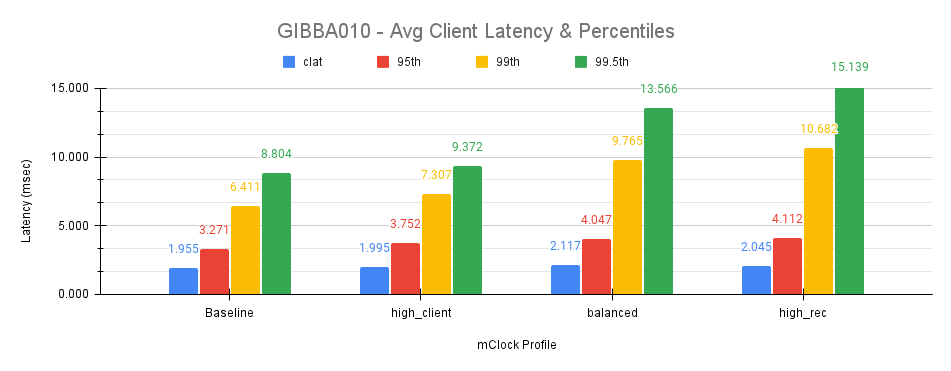](images/Img21_GIBBA010_Avg_Client_Lat_Pct.png)

Fig. 21: mClock Scaled Testing - Average Client and Percentile Latency Comparison
 

Fig. 21 above shows the average latencies and the tail latencies on the client during the course of the test. The *high_client_ops* profile shows the lowest average and tail latencies. The average completion latency for the *high_recovery_ops* profile is lower than the *balanced* profile which is counterintuitive but possible for reasons already explained. But, the tail latencies (95th, 99th and 99.5th) for the *high_recovery_ops* profile is the highest among the mClock profiles which clearly indicates the effect of throttling by mClock.

#### Recovery Rate Comparison

The charts in this section compares the recovery rates across the mClock profiles. From the bar chart in Fig. 22, the *high_client_ops* profile shows the lowest recovery rate of ~192 Objects/sec and the highest recovery time of ~3825 secs to recover ~730K objects. This is followed by the *balanced* profile with a recovery rate of ~253 Objects/sec and a recovery time of ~2586 secs (32% lower) to recover ~650K objects. The *high_recovery_ops* profile provides the best recovery performance with a rate of ~341 Objects/sec and the lowest recovery time of ~1908 secs to recover ~650K objects. This is over 50% faster than the *high_client_ops* profile and with only a marginal 4.6% increase in the client completion latency. This underscores the effectiveness of mClock to provide the desired level of QoS under heavy recovery load.

[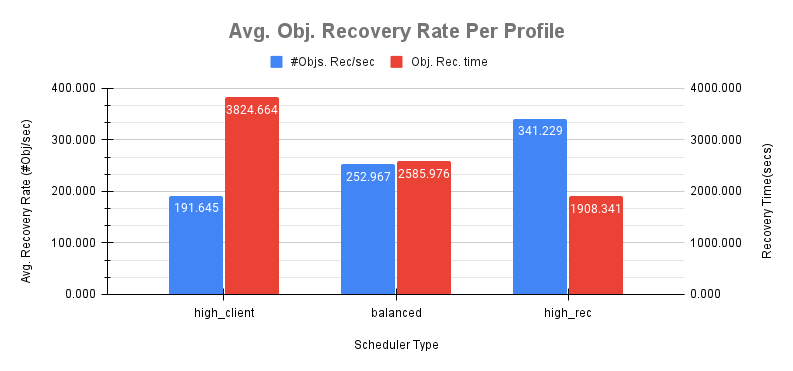](images/Img22_Avg_Ob_Rec_Rate_Per_Profile.png)

Fig. 22: mClock Scaled Testing - Average Object Recovery Rates
 

The recovery rate comparison in Fig. 23 below further elucidates the difference between the mClock profiles and is self explanatory.

[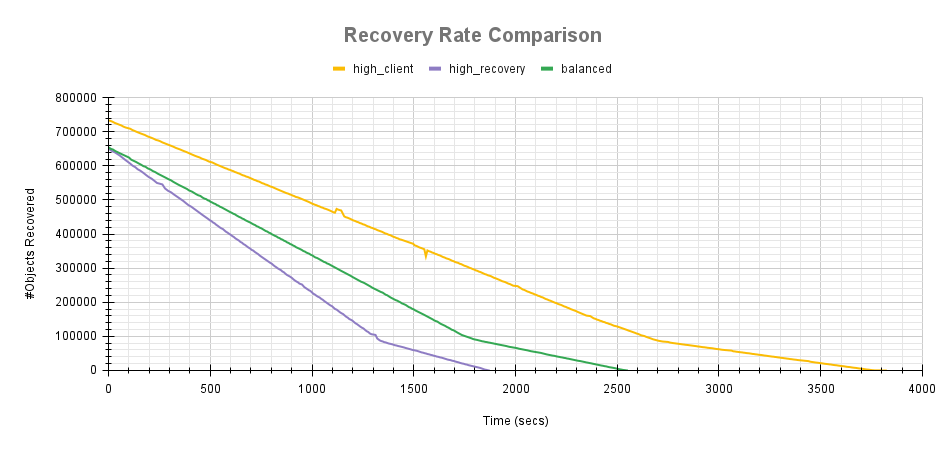](images/Img23_Rec_Rate_Cmp.png)

Fig. 23: mClock Scaled Testing - Recovery Rate Comparison
 

## Conclusion

This study was focused on utilizing the features of the mClock algorithm with a goal to improve external client latency and throughput and provide predictable QoS to internal Ceph specific operations. The study experimented with the different mClock profiles and multiple permutations and combinations of QoS parameters for the background best effort class of operations in Ceph.

The results show that after proper allocation of QoS parameters, the desired throughput and latency requirements for recovery, snaptrim and client ops were met. There is scope for further improvement going forward considering the small scale of testing performed in this study.

Tests at a larger logical scale provide additional data points and consolidate the effectiveness of the mClock profiles. The next steps involve coming up with new profile(s) to cater to specific requirements.
